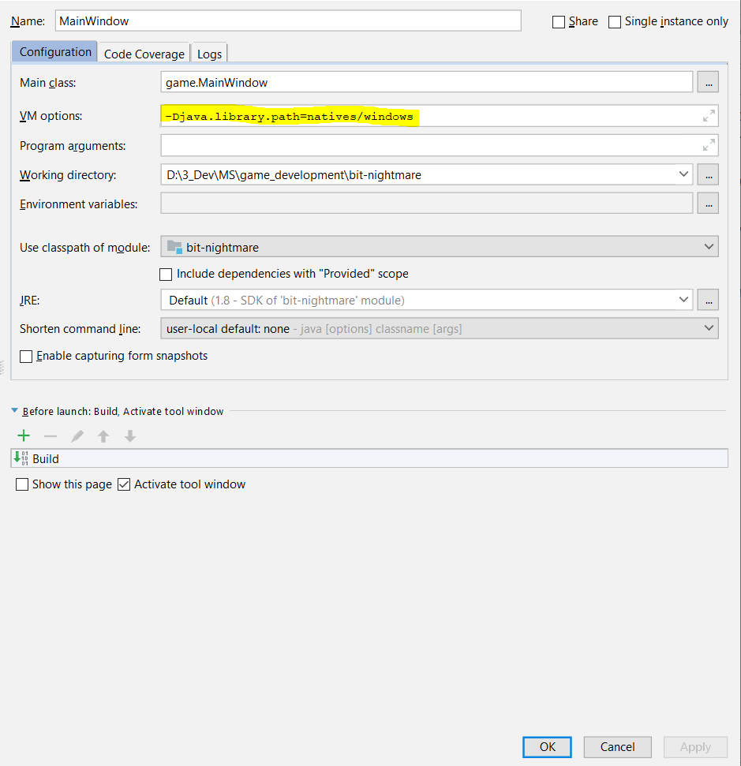

This project is a maven project and needs to be imported as one to work correctly. It uses different libraries for 
audio and game pad integration.

These external libraries also need some native dependencies which I have saved in the `natives` folder in the project
directory. To run this project, apart from importing it as a maven project you have to give the path of the native
libraries as input. 

`java -Djava.library.path=/natives/windows/ game.MainWindow`

Screen shot for setting this in intellij.

