# BIT NIGHTMARE

* Thanks [Craftpix](https://craftpix.net/) and [Open Game Art](https://opengameart.org/) for amazing assets.
* Thanks [1001 Fonts](https://www.1001fonts.com/) for excellent fonts.
* Thanks [DL Sounds](https://www.dl-sounds.com/) for stunning sounds.
* Thanks [RealTutsGML](https://www.youtube.com/user/RealTutsGML) for phenomenal tutorial on Java game programming.

**Gameplay Video** - https://www.youtube.com/watch?v=0y7qBGYuIDE

## Genre/Theme
A 2-D platformer where a programmer is trapped in an Alien prison

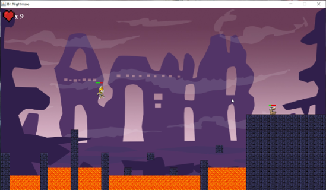

Long jumps on narrow platforms.

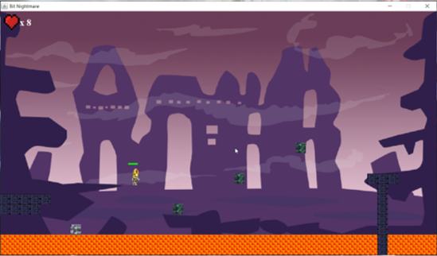

Moving blocks and Hiding platforms.

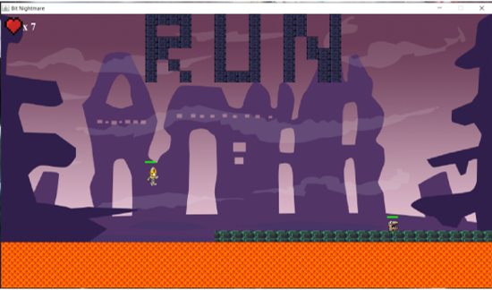

Nerve-breaking running sequences.

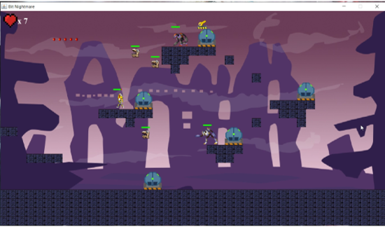

Mayhem battles.

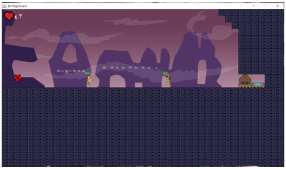

Boss battle.

**Extras**

* An Arcade style sound track.
* Artwork to give a sci-fi look and feel.

## Features

**Level Designer**

* Currently the game has two levels.
* A basic level designer is implemented that can generate complete levels from .png files
* Everything is Dynamic. We can add levels without changing a single line of code(Until we want to add new game objects).

**Difficulty Options**

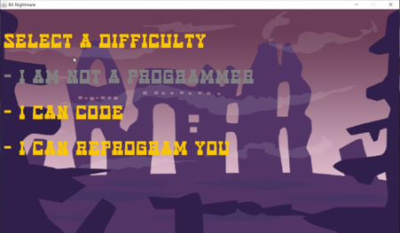

* 3 difficulty options
* Affect different properties of enemies such as their health, line of sight, bullet frequency, etc.

**Weapons**

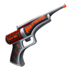

* Bit Revolver
* Shoots single projectiles

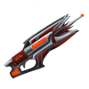

* Bit Array Gun
* Shoots stream of projectiles

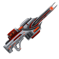

* Bit Matrix Blast
* Shoots single projectile but with bigger area and high damage.

**Checkpoints**

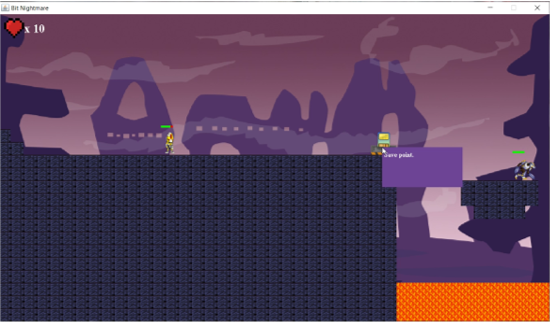

**Collision Detection**

* Rectangle based collision detection.
* Abstracted some collision scenarios as behaviours and created `BulletCollider`, `EnemyCollider`, `FineGrainedCollider`.
* Quad tree implementation for static environment objects and collectibles. Implemented chopping.

**Texture Loader**

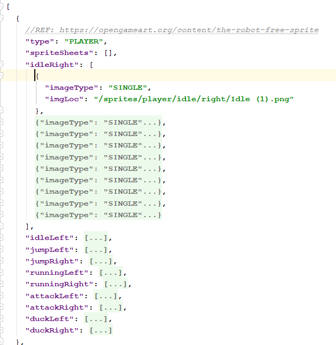

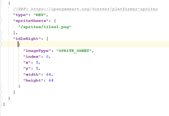

* 100% configurable
* Can be used with both single images and sprite sheets.

**Story Loader**

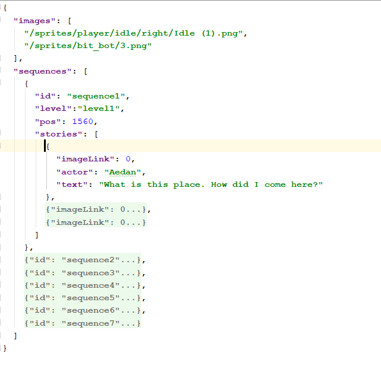

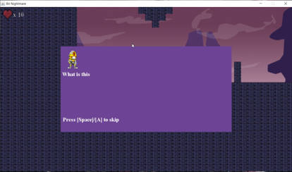

Stories can be created by giving the level name and the x-coordinate of the player.

**Enemies with Basic AI**

* Charger
* Runs towards you if under LOS.

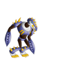

* Soldier
* Fires Bit revolver towards you if under LOS.
* Will duck occasionally

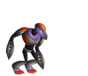

* Super Soldier
* Fires Bit Array gun towards you if under LOS.
* Will duck occasionally.

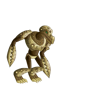

* Guardian
* Fires Dual Bit Array guns and Bit Matrix blast towards you if under LOS.
* Will charge towards you occasionally.

**Intelligent/Interactive Environments**

* Movable blocks
* Hiding platforms
* Enemy portals – Spawn enemies if you are under LOS
* Gate and Key pairs

## Functional Game

**Lives**

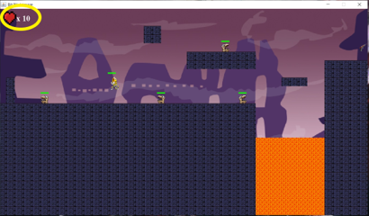

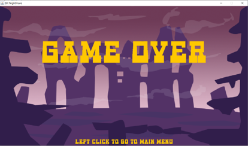

**Ending**

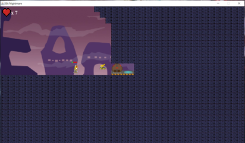

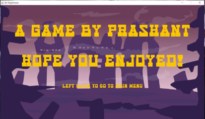

The game can be won by defeating the guardian at the second level and acquiring his key to open the last gate of the game.

## Multiple Controllers

**Mouse interactions**

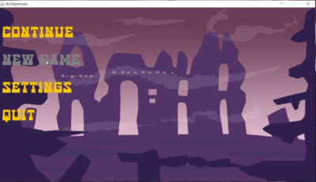

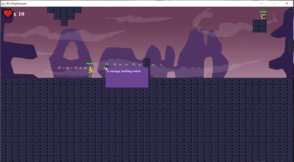

* On Menu
* By right clicking on objects

**Gamepad/Keyboard**

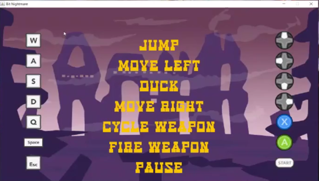

